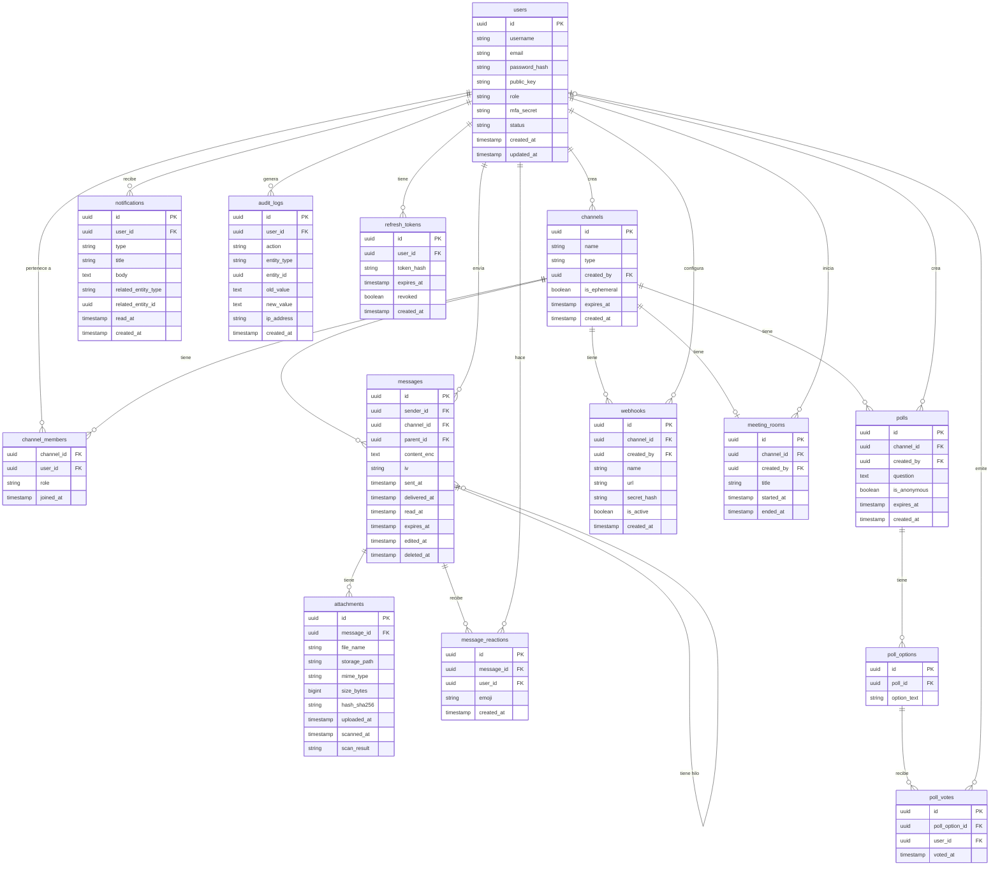

# Diagrama Entidad-Relación — App de Mensajería Empresarial

> Versión 1.0 — Alcance total del proyecto

---



---

## Notas del modelo

### Decisiones de diseño

| Entidad | Decisión | Motivo |
|---|---|---|
| `messages.parent_id` | Auto-referencia (nullable) | Soporta hilos sin tabla extra |
| `messages.content_enc` + `iv` | Contenido siempre cifrado | Requisito excluyente E2E / AES-256-GCM |
| `users.public_key` | Almacenada en servidor | Necesaria para derivación ECDH entre pares |
| `poll_votes.user_id` | Nullable | Soporte para votaciones anónimas |
| `channels.is_ephemeral` + `expires_at` | Flag + timestamp | Salas de reunión con auto-destrucción |
| `attachments.hash_sha256` | Hash de integridad | Verificación al descargar (sección 2 propuesta) |
| `audit_logs.old_value / new_value` | JSON serializado | Trazabilidad completa para compliance |

### Entidades por módulo

| Módulo | Entidades |
|---|---|
| Auth & Sesiones | `users`, `refresh_tokens` |
| Mensajería | `channels`, `channel_members`, `messages` |
| Archivos | `attachments` |
| Interacción | `message_reactions`, `polls`, `poll_options`, `poll_votes` |
| Notificaciones | `notifications` |
| Auditoría | `audit_logs` |
| Bots & Webhooks | `webhooks` |
| Reuniones | `meeting_rooms` |
```
